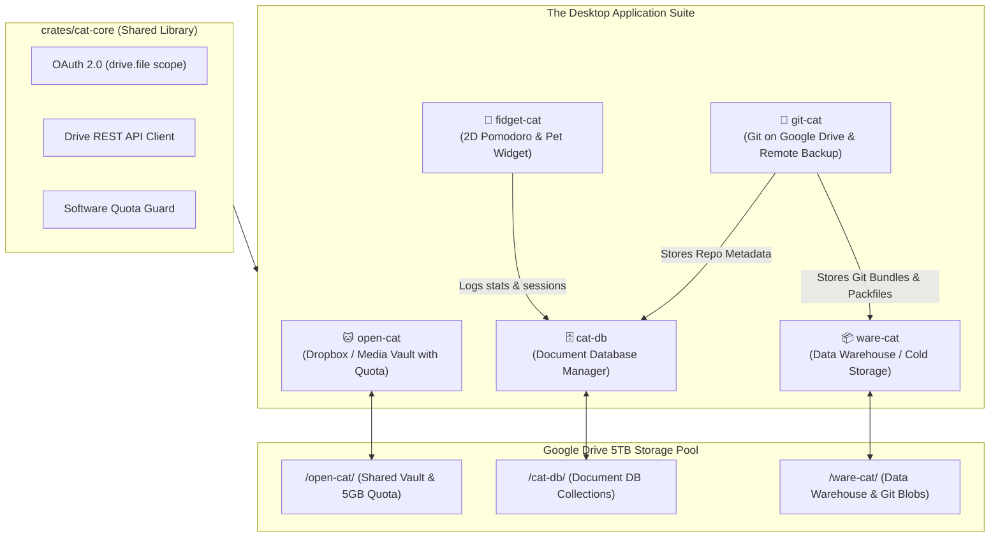

# The Cat Ecosystem: Master Project Specification & Blueprint
> **A 100% Rust, Low-Memory Personal Cloud & Productivity Suite Powered by Google Drive (5TB)**

---

## 0. AI Operating Rules & Collaboration Guidelines

> [!IMPORTANT]
> ### 🛡️ ROLE OF THE AI ASSISTANT (Senior Architect & Engineering Manager)
> When this specification is provided to Antigravity (or any AI assistant on your development machine), the AI must strictly adhere to the following rules:
>
> 1. **Architectural & Planning Guide**: Break down features into clear, bite-sized tasks, architectural diagrams, data flows, and checklists that the developer can read and implement.
> 2. **Documentation & Reference Source**: Explain complex protocols, Google Drive API behaviors, `egui` lifecycle patterns, and Rust borrow checker concepts in plain English.
> 3. **NO UNSOLICITED CODE**: 
>    * **The AI MUST NOT write the project code.**
>    * **The AI MUST NOT output full implementation code or copy-paste code snippets unless the user EXPLICITLY asks** (e.g., *"Show me the code for this function"* or *"Write this struct for me"*).
> 4. **Senior Tech Lead Persona**: Act as a technical mentor / engineering manager. Review the developer's code when asked, explain compiler errors, suggest design improvements, and point out edge cases.

---

## 1. Executive Summary & Philosophy

The **Cat Ecosystem** is a modular suite of lightweight personal desktop applications and microservices written in **100% Rust**, backed by a 5TB Google Drive storage pool.

### Core Architectural Principles:
1. **Featherlight Footprint**: No Garbage Collection, no Electron, no Chromium overhead. Background daemons run at **15–30 MB RAM**.
2. **Simple, Idiomatic Rust**: Standard data structs (`serde`), `tokio` async networking, MPSC channels, and native `egui` immediate-mode GUIs.
3. **Google Drive as Personal Cloud**: Uses the isolated `https://www.googleapis.com/auth/drive.file` scope. The apps only see files they create.
4. **Single-User Coherence**: The apps seamlessly cross-integrate: `fidget-cat` stores streak metadata in `cat-db`, `git-cat` archives packfiles in `ware-cat`, and `open-cat` shares files with friends under strict 5GB quotas.

---

## 2. The 5 Microservices + Core Engine



---

### App 1: `open-cat` (The Shared File Vault)
* **Purpose**: A personal Dropbox/photo vault with drag-and-drop upload and video streaming.
* **Features**:
  * Standalone `egui` GUI with a clean dropzone.
  * **5GB Quota Guard**: Hard software-enforced 5GB cap per shared folder via `_meta/quota.json`.
  * **Friend Sharing**: Distributable configuration key scoped strictly to the `open-cat` folder.
  * **Media Streaming**: Streams videos into VLC/mpv via local HTTP Range proxy.

---

### App 2: `cat-db` (The Document Database Manager)
* **Purpose**: A visual NoSQL Document Store GUI that turns a Google Drive folder into a database.
* **Storage Schema**:
  ```text
  /cat-db/
  ├── _system/
  │   ├── manifest.json       <-- Fast RAM index (Collections list, doc counts)
  │   └── stats.json
  └── collections/
      ├── users/
      │   ├── doc_001.json
      │   └── doc_002.json
      └── pomodoro_logs/      <-- Populated by fidget-cat!
          └── session_101.json
  ```
* **Features**:
  * Visual collection tree and JSON document editor.
  * Fast in-memory manifest caching for sub-millisecond filtering.

---

### App 3: `fidget-cat` (The Productivity Desk Pet)
* **Purpose**: A tiny, always-on-top 2D desktop widget for focus and fun.
* **Features**:
  * **2D Pixel/Vector Pet**: An animated sleeping cat you can pet with your mouse (rendered with `egui::Painter`).
  * **Pomodoro & Focus Timer**: Work/break intervals with customizable notifications.
  * **Ecosystem Hook**: Focus session logs, productivity streaks, and pet happiness levels automatically save into `cat-db`!
  * **RAM Footprint**: Under 15 MB.

---

### App 4: `ware-cat` (The Data Warehouse & Archive)
* **Purpose**: Cold storage, large immutable blob archiving, and analytical data lake on Google Drive.
* **Features**:
  * Stores large data assets (Git bundles, compressed backups, raw footage).
  * Manages append-only JSONL / Parquet event logs.
  * Provides batch upload, integrity verification (SHA-256), and file deduplication.

---

### App 5: `git-cat` (Git Remote & Hosting on Google Drive)
* **Purpose**: Host private Git repositories directly on your Google Drive without third-party services.
* **How It Works**:
  * **Git Bundle Engine**: Uses Git's native bundle mechanism (`git bundle create repo.bundle --all`) or bare repository packfiles.
  * **Storage**: `git-cat` stores immutable packfiles and bundles inside `ware-cat`, while commit metadata, branches, and tags are indexed in `cat-db`.
  * **Sharing**: Repositories can be shared with friends via `open-cat` folders.

---

## 3. Cargo Workspace Layout

```text
cat-ecosystem/
├── Cargo.toml
├── crates/
│   └── cat-core/               # Shared Drive API, OAuth, Quotas, Models
├── apps/
│   ├── open-cat/               # App 1: Vault GUI
│   ├── cat-db/                 # App 2: Document DB GUI
│   ├── fidget-cat/             # App 3: 2D Pomodoro & Pet
│   ├── ware-cat/               # App 4: Data Warehouse & Blobs
│   ├── git-cat/                # App 5: Git Remote & Manager
│   └── cat-daemon/             # Background local server (Axum streaming)
└── README.md
```

### `Cargo.toml` (Root Workspace)
```toml
[workspace]
resolver = "2"
members = [
    "crates/cat-core",
    "apps/open-cat",
    "apps/cat-db",
    "apps/fidget-cat",
    "apps/ware-cat",
    "apps/git-cat",
    "apps/cat-daemon",
]

[workspace.dependencies]
tokio = { version = "1.37", features = ["full"] }
serde = { version = "1.0", features = ["derive"] }
serde_json = "1.0"
reqwest = { version = "0.12", features = ["json", "stream", "multipart"] }
eframe = "0.27"
egui = "0.27"
open = "5.1"
rfd = "0.14"
git2 = "0.18"
```

---

## 4. Google Drive API Technical Rules

1. **Authentication Scope**:
   ```text
   https://www.googleapis.com/auth/drive.file
   ```
2. **Quota Guard Formula**:
   $$\text{used\_bytes} + \text{incoming\_file\_bytes} \le \text{max\_allowed\_bytes}$$
   *If violated, reject immediately before initiating byte transfer.*
3. **Video / Media Streaming**:
   * Axum on `127.0.0.1:4040` proxies HTTP `Range` requests to Google Drive `GET /files/{id}?alt=media`.
   * Desktop player (VLC) streams with instant scrubbing.

---

## 5. Development Roadmap & Task Progression

### Phase 1: Shared Core (`crates/cat-core`)
- [ ] Initialize Cargo workspace.
- [ ] Implement OAuth 2.0 PKCE desktop flow + `token.json` caching.
- [ ] Implement Google Drive v3 REST Client (Folder create/find, list, chunked upload, download).
- [ ] Implement Quota Guard (`_quota.json` read/write/verify).

### Phase 2: Background Server (`apps/cat-daemon`)
- [ ] Axum server listening on `127.0.0.1:4040`.
- [ ] `/oauth/callback` handler.
- [ ] `/stream/:file_id` Range-proxy streaming endpoint.

### Phase 3: The File Vault (`apps/open-cat`)
- [ ] `eframe` window with drag-and-drop dropzone.
- [ ] 5GB visual storage gauge.
- [ ] File grid with download and VLC streaming actions.

### Phase 4: Document Database (`apps/cat-db`)
- [ ] Empty folder initializer (scaffolds `_system/manifest.json` & `collections/`).
- [ ] Visual collection tree & JSON document inspector.
- [ ] In-memory manifest caching for fast queries.

### Phase 5: Productivity Pet (`apps/fidget-cat`)
- [ ] Lightweight 2D floating window with custom `egui::Painter` pet.
- [ ] Pomodoro work/break timer state machine.
- [ ] Sync focus logs to `cat-db`.

### Phase 6: Warehouse & Git (`apps/ware-cat` & `apps/git-cat`)
- [ ] `ware-cat` blob storage and chunked archive manager.
- [ ] `git-cat` repository packfile/bundle exporter (`git2` crate).
- [ ] Push/pull Git bundles directly to/from Google Drive.

---

## 6. How to Direct Antigravity on Your Laptop

Whenever you start a session on your laptop, point Antigravity to this file. Antigravity will act strictly as your Tech Lead:

* **Example Request 1**: *"Read `CAT_ECOSYSTEM_MASTER_SPEC.md`. Break down Phase 1 into detailed implementation steps and document the OAuth2 loopback protocol for me to code."*
* **Example Request 2**: *"I'm writing `crates/cat-core/src/quota.rs`. Here is my code. Review it for edge cases and tell me if I handled race conditions properly."*
* **Example Request 3**: *"Explain the state transitions needed for `fidget-cat`'s Pomodoro timer without writing the code for me."*
