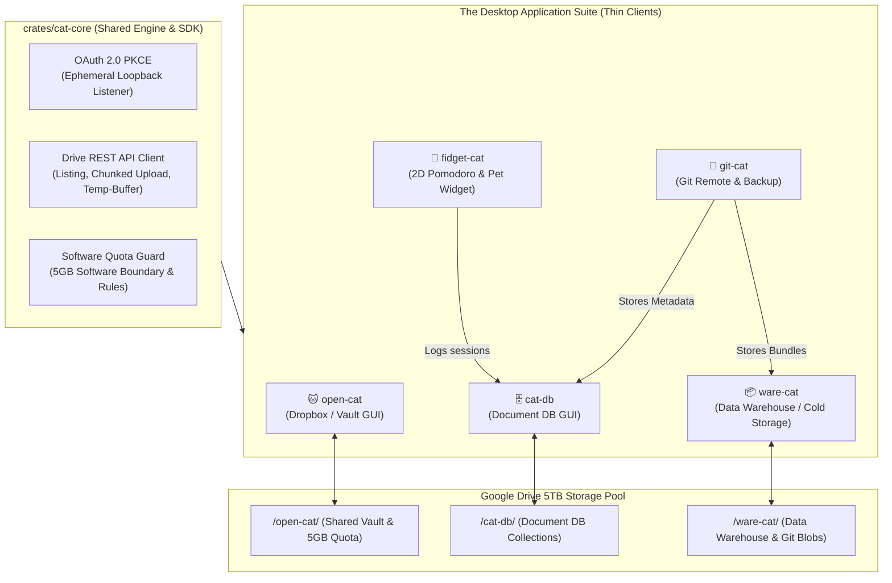

# 🐾 The Cat Ecosystem

> **A 100% Rust, Low-Memory Personal Cloud & Productivity Suite Powered by Google Drive (5TB)**

Welcome to the **Cat Ecosystem**! This repository houses a modular suite of lightweight, native desktop applications and microservices. Built on a **"Thick Core, Thin Client"** architecture, the ecosystem uses **Google Drive** as a personal cloud backend with zero persistent local web servers or background daemons, running entirely on native, featherlight Rust binaries (< 35MB RAM).

---

## 🏗️ Architectural Philosophy: Thick Core, Thin Client

The ecosystem is designed around a single, powerful shared engine (`cat-core`) that acts as the SDK for all applications. Microservices (`open-cat`, `cat-db`, etc.) remain thin UI shells responsible only for rendering pixels and dispatching actions.



---

## ⚙️ The Core Engine: `crates/cat-core`

`cat-core` is a shared Rust library (`lib.rs`) compiled directly into all applications. It encapsulates:

1. **OAuth 2.0 PKCE (Ephemeral Loopback)**: Binds to a dynamic OS port (`127.0.0.1:0`) only during sign-in, extracts the authorization code, and drops the listener immediately. Zero persistent open ports.
2. **Drive REST SDK**: Async `reqwest` client managing folder discovery (`/open-cat/` & `_meta/`), paginated file listing, resumable chunked uploads, and temp-buffering downloads.
3. **Software Quota Guard & Rules**: Enforces the 5GB folder constraint ($\text{used} + \text{incoming} \le 5\text{GB}$) by maintaining `_meta/quota.json` on Google Drive.

---

## 🐈 The Microservice Suite (Thin Desktop Apps)

#### 1. `open-cat` (The Shared File Vault)
A personal Dropbox and photo vault with a native `egui` interface.
* **Dropzone:** Drag-and-drop file upload with live progress bars.
* **Quota Gauge:** Visual 5GB capacity meter.
* **Native Media Playback:** Downloads media into the OS temporary directory (`std::env::temp_dir()`) and spawns the native media player (VLC/QuickTime) without local HTTP proxy overhead.
* **Sharing Keys:** Distributable base64 keys to share vaults with friends.

#### 2. `cat-db` (The Document Database Manager)
A visual NoSQL Document Store GUI turning a Google Drive folder into a document database with sub-millisecond in-memory manifest caching.

#### 3. `fidget-cat` (The Productivity Desk Pet)
An always-on-top 2D desktop widget featuring an animated pet and a Pomodoro timer that automatically logs focus sessions into `cat-db`.

#### 4. `ware-cat` (The Data Warehouse & Archive)
Cold storage and analytical data lake managing append-only JSONL / Parquet logs with SHA-256 integrity verification.

#### 5. `git-cat` (Git Remote on Google Drive)
Host private Git repositories directly on Google Drive by archiving Git bundles into `ware-cat` and indexing commits in `cat-db`.

---

## 🛠️ Technology Stack & Paradigms

* **Language:** 100% Rust 🦀
* **Architecture:** Thick Core SDK (`cat-core`) + Thin Immediate-Mode GUIs (`egui` / `eframe`)
* **Paradigms:**
  * **OOP:** Clean encapsulation via Structs and `impl` blocks (e.g., `DriveClient`).
  * **Functional Programming (FP):** Iterator pipelines (`.map()`, `.filter()`, `.sum()`), monadic error handling (`Result`/`Option`), and UI closure trees.
* **Async Runtime:** `tokio` (Multi-threaded background task execution decoupled from 60 FPS UI loops).
* **Backend:** Google Drive API v3 (`https://www.googleapis.com/auth/drive.file` isolated scope).

---

## 📁 Workspace Layout

```text
nappy-cat/
├── crates/
│   └── cat-core/           # Shared Engine, OAuth PKCE, Drive SDK, Quota Guard
├── apps/
│   ├── open-cat/           # App 1: Vault GUI
│   ├── cat-db/             # App 2: Document DB GUI
│   ├── fidget-cat/         # App 3: 2D Pomodoro & Pet
│   ├── ware-cat/           # App 4: Data Warehouse & Blobs
│   └── git-cat/            # App 5: Git Remote & Manager
├── tasks/
│   ├── cat-core/           # Core SDK Jira tasks (CORE-1 to CORE-4)
│   └── open-cat/           # GUI client Jira tasks (OPENCAT-1 to OPENCAT-4)
└── README.md
```

---

## 💻 Getting Started

This repository is configured as a Cargo workspace. To build and test:

```bash
# Verify all workspace crates compile cleanly
cargo check --workspace

# Run the Open-Cat desktop GUI
cargo run --bin open-cat
```
